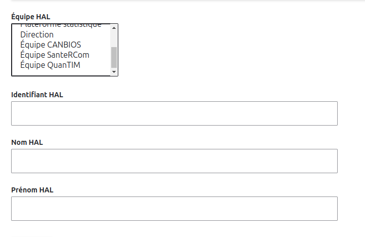
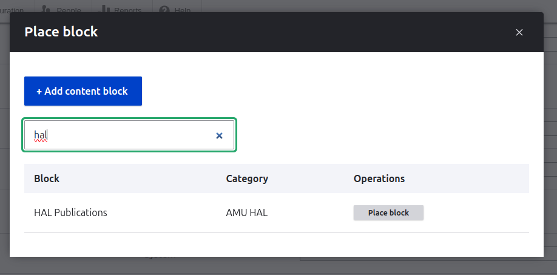
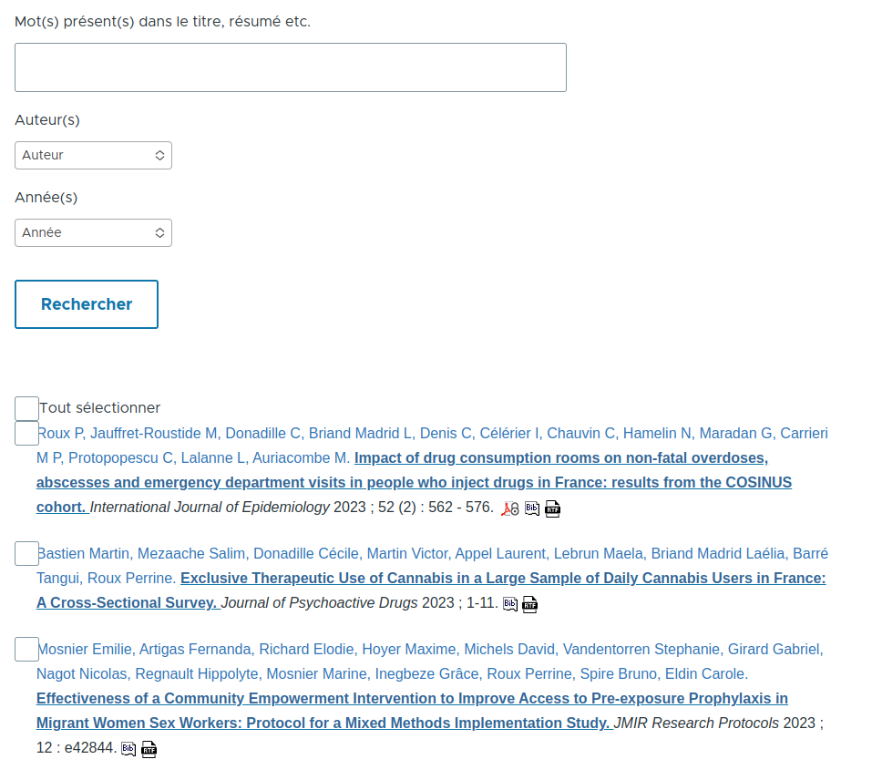

# HAL-Drupal Archives Ouvertes connector
Drupal 9 / 10 module that connects to Archive Ouverte API to display publications.

# Requirements
* The user account form should contain multiple necessary fields:
  * The user's HAL ID.
  * The user's first name.
  * The user's last name.
  * A select list containing the user's teams options (Teams should be references to a specific content type).
    
    
    
* Chosen Drupal module - https://www.drupal.org/project/chosen.
* Download the Chosen jQuery plugin - https://harvesthq.github.io/chosen
  * Via Drush: drush chosenplugin
  * Extract the plugin under libraries/chosen.

# Functionalities
* Choose publications source from multiple publications portals.
* Choose whether to add a user page publications tab or not.
* Display publications published by the website's users.
* Display publications published by the selected teams.
* Filter by keywords.
* Filter by publication author(s).
* Filter by publication year(s).
* Display publications following the Vancouver format:
https://www.zotero.org/styles?q=id%3Avancouver-brackets-no-et-al.
* Export a single or multiple publications in BibTex.
* Export a single or multiple publications in RTF.

# Add new HAL block
* Create and configure a block (AMU HAL) in Structure – Blocks
  
  
 
* Choose to either display filters or not.
* Choose between a simple or multiple authors select list.
* Choose between a simple or multiple years select list.
  
  
  
* Filter publications by teams (leave empty for all teams).

  ### HAL AMU Block:
  

# Publications by author
* Check the "Display user tab" in the module configuration form. /admin/hal.
* Fill the "user page publication tab title" field.
